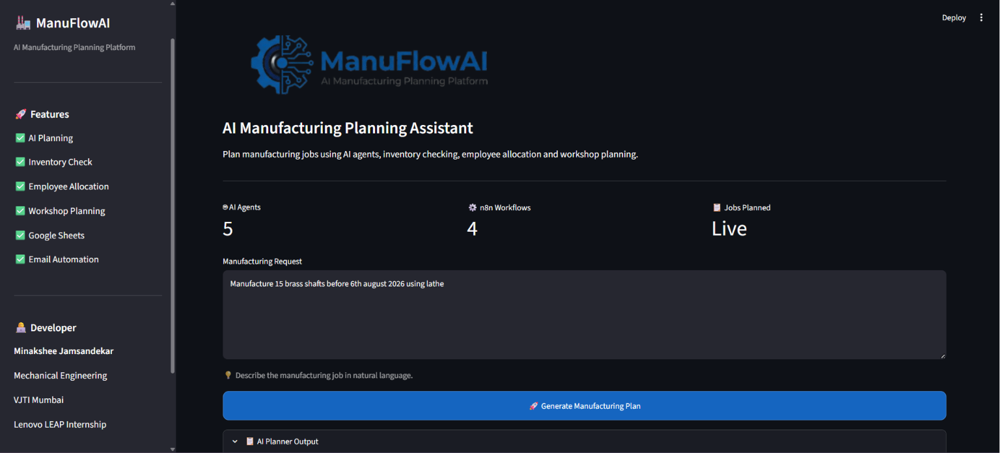
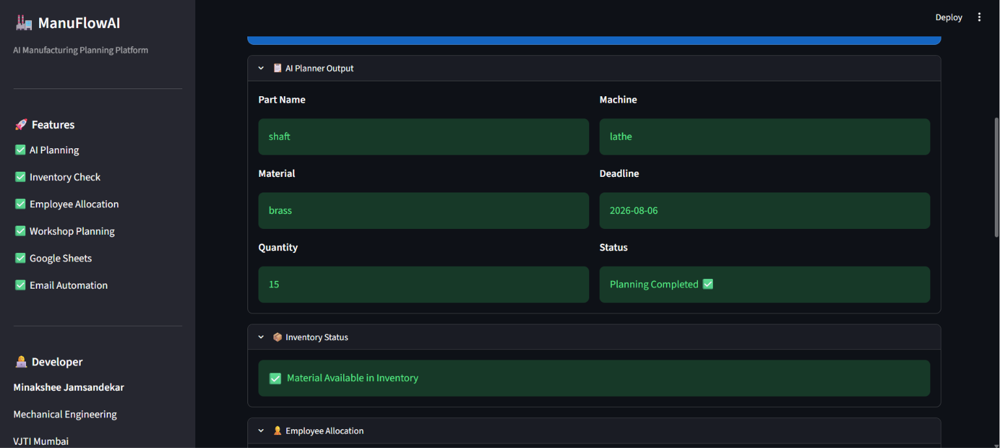
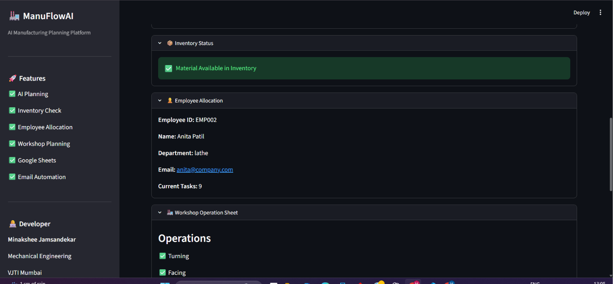
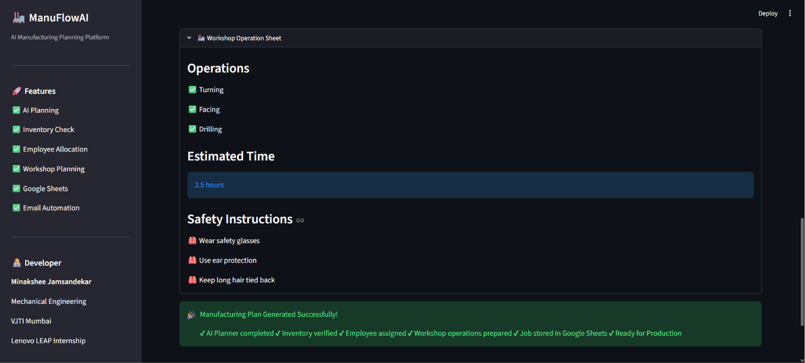
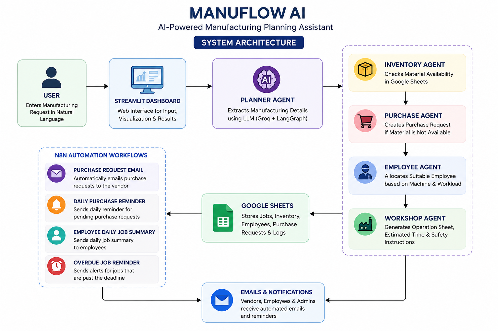

# 🏭 ManuFlowAI

An AI-powered Manufacturing Planning Assistant built using **LangGraph, Streamlit, Google Sheets, and n8n**.

## 🚀 Features

- 🤖 AI Manufacturing Planner
- 📦 Inventory Availability Check
- 🛒 Automatic Purchase Request Generation
- 👷 Employee Allocation
- 🏭 Workshop Operation Sheet Generation
- 📊 Google Sheets Integration
- 📧 Email Automation using n8n
- ⏰ Daily Job Summary Automation
- 📌 Overdue Job Reminder Automation

---
## Dashboard Preview



## AI Planner



## Employee Allocation



## Workshop Planning




## 🛠 Tech Stack

- Python
- Streamlit
- LangGraph
- LangChain
- Groq LLM
- Google Sheets API
- gspread
- n8n
- Gmail API

---

## 📂 Project Structure

```text
ManuFlowAI/
│
├── agents/
├── database/
├── graph/
├── models/
├── ui/
├── requirements.txt
└── README.md
```
## System Architecture


---

## ⚙️ Workflow

1. User enters a manufacturing request.
2. AI extracts manufacturing details.
3. Inventory is checked.
4. Purchase Request is generated if stock is unavailable.
5. Employee is assigned.
6. Workshop operation sheet is prepared.
7. Job is stored in Google Sheets.
8. n8n automations handle notifications and reminders.

---

## 🤖 AI Agents

- Planner Agent
- Inventory Agent
- Purchase Agent
- Employee Agent
- Workshop Agent

---

## 🔄 n8n Workflows

- Purchase Request Email Automation
- Daily Purchase Reminder
- Employee Daily Job Summary
- Overdue Job Reminder

---
## Installation

Clone the repository

```bash
git clone https://github.com/MinaksheeJ30/ManuFlowAI.git
```

Go into the project

```bash
cd ManuFlowAI
```

Create virtual environment

```bash
python -m venv .venv
```

Activate it

Windows

```bash
.venv\Scripts\activate
```

Install dependencies

```bash
pip install -r requirements.txt
```

Run Streamlit

```bash
streamlit run ui/dashboard.py
```

## 👩‍💻 Developer

**Minakshee Jamsandekar**

Mechanical Engineering

VJTI Mumbai

Lenovo LEAP Internship 2026
